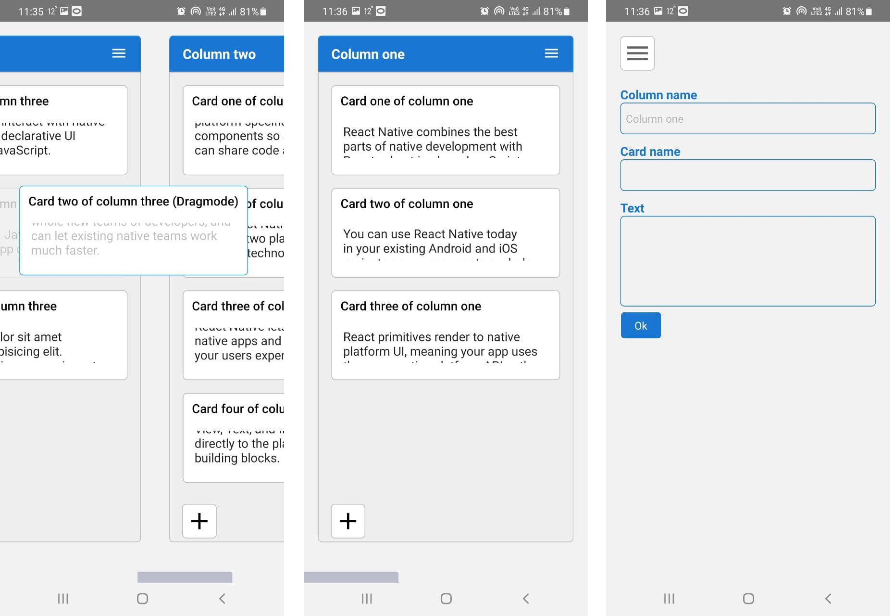

# My 1st React Native App
# Description
Простое приложение. Позволяет создавать карточки, размещать их в колонках. Есть возможность создавать свои колонки, перетаскивать карточки из колонки в колонку.
Нуждается в доработках, после чего появится в Play Market
## .apk files
<a href="https://github.com/AlexanderBaikal/react-native-test/tree/master/apks">Папка с .apk</a> 
Под разные типы процессоров:
<a href="https://github.com/AlexanderBaikal/react-native-test/blob/master/apks/app-arm64-v8a-release.apk">.apk arm64-v8a</a>
<a href="https://github.com/AlexanderBaikal/react-native-test/blob/master/apks/app-armeabi-v7a-release.apk">.apk armeabi-v7a</a>
<a href="https://github.com/AlexanderBaikal/react-native-test/blob/master/apks/app-x86-release.apk">.apk x86</a>
<a href="https://github.com/AlexanderBaikal/react-native-test/blob/master/apks/app-x86_64-release.apk">.apk x86_64</a>
## Screenshots

